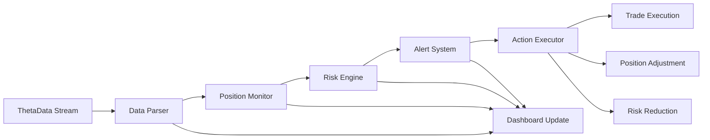

# Real-Time Strangle Trade Management System

## Overview
This document outlines a comprehensive real-time monitoring and management system for strangle trades using ThetaData's streaming API. The system will track positions, manage risk, and execute adjustments automatically based on predefined rules.

## System Architecture

### 1. Core Components

#### Real-Time Data Stream Manager
- **Purpose**: Connect to ThetaData WebSocket stream for live market data
- **Location**: `trading_engine/realtime_trade_manager.py`
- **Key Functions**:
  - Establish and maintain WebSocket connection
  - Subscribe to real-time quotes for active positions
  - Parse and distribute streaming data
  - Handle reconnection and error recovery

#### Position Tracking System
- **Purpose**: Track and calculate real-time position metrics
- **Location**: `trading_engine/position_tracker.py`
- **Key Functions**:
  - Track open strangle positions
  - Calculate real-time P&L
  - Monitor delta neutrality
  - Track Greeks evolution throughout the day

#### Risk Management Engine
- **Purpose**: Monitor and enforce risk limits
- **Location**: `trading_engine/risk_manager.py`
- **Key Functions**:
  - Define and monitor risk thresholds
  - Calculate portfolio-level Greeks
  - Trigger defensive actions
  - Log risk events for analysis

#### Alert & Action System
- **Purpose**: Generate alerts and execute trading actions
- **Location**: `trading_engine/alert_system.py`
- **Key Functions**:
  - Price breach notifications
  - Delta threshold warnings
  - Profit target alerts
  - Auto-adjustment execution

### 2. Real-Time Dashboard Interface

```
┌─────────────────────────────────────────────────────────────────┐
│ STRANGLE MONITOR - SPY 0DTE                      [Auto-Manage] │
├─────────────────────────────────────────────────────────────────┤
│ Position Summary                                                │
│ ├─ Entry: 2:00 PM | Strikes: 555C/545P | Credit: $0.32        │
│ ├─ Current Time: 3:15 PM | Time Remaining: 45 min             │
│ └─ Status: ACTIVE ● | Auto-Manage: ON                          │
│                                                                 │
│ Real-Time Metrics                                               │
│ ├─ SPY Price: $550.25 ▲ (+0.15%)                              │
│ ├─ P&L: +$0.08 (+25.0%) ████████░░░░░░░░░░░░                 │
│ ├─ Call: $0.05 (bid) / $0.06 (ask) | IV: 12.5%               │
│ └─ Put: $0.19 (bid) / $0.20 (ask) | IV: 13.2%                │
│                                                                 │
│ Greeks Monitor                                                  │
│ ├─ Delta: +0.03 ✓ [-0.10, +0.10]                             │
│ ├─ Gamma: 0.12 ⚠️  [warning > 0.10]                           │
│ ├─ Theta: -$0.18 (accelerating)                               │
│ └─ Vega: $0.05                                                 │
│                                                                 │
│ Risk Alerts                                                     │
│ ├─ ⚠️ Put strike threatened: SPY 1.2% away from 545           │
│ ├─ ✓ Delta within neutral range                               │
│ └─ ✓ 25% profit target reached - consider closing             │
│                                                                 │
│ Actions                                                         │
│ [Close All] [Close 50%] [Roll Put] [Add Protection] [Settings]│
└─────────────────────────────────────────────────────────────────┘
```

## Real-Time Data Flow



## Risk Management Rules

### 1. Entry Validation
- **Spread Check**: Bid-ask spread < 2% of mid price
- **Volume Check**: Open interest > 100 contracts
- **Delta Balance**: Combined delta within ±0.05
- **IV Check**: IV rank > 30th percentile

### 2. Position Monitoring Rules

#### Delta Limits
```python
DELTA_RULES = {
    "warning_threshold": 0.08,
    "action_threshold": 0.10,
    "emergency_threshold": 0.15,
    "check_frequency": "every_tick"
}
```

#### Profit Targets
```python
PROFIT_TARGETS = {
    "target_1": {"percent": 25, "action": "alert"},
    "target_2": {"percent": 50, "action": "close_half"},
    "target_3": {"percent": 75, "action": "close_all"}
}
```

#### Stop Loss Rules
```python
STOP_LOSS_RULES = {
    "max_loss": -200,  # -200% of credit received
    "strike_breach": {"distance": 0.002, "action": "evaluate"},
    "time_stop": {"minutes_remaining": 30, "min_profit": 10}
}
```

### 3. Automated Actions

#### Adjustment Triggers
1. **Delta Adjustment**
   - Trigger: |Delta| > 0.10
   - Action: Roll untested side to restore neutrality

2. **Gamma Scalping**
   - Trigger: Gamma > 0.15 and profitable
   - Action: Reduce position size by 25%

3. **Time-Based Exit**
   - Trigger: < 30 minutes to close AND profit > 10%
   - Action: Close entire position

#### Emergency Procedures
1. **Rapid Market Move**
   - Trigger: SPY moves > 1% in 5 minutes
   - Action: Evaluate all positions for immediate risk

2. **Liquidity Crisis**
   - Trigger: Bid-ask spread > 10% of mid
   - Action: Alert only, no auto-execution

3. **System Failure**
   - Trigger: Data feed interruption > 30 seconds
   - Action: Freeze all automated actions

## Implementation Roadmap

### Phase 1: Core Infrastructure (Week 1-2)
- [ ] Set up WebSocket connection manager
- [ ] Implement real-time data parser
- [ ] Create position state tracker
- [ ] Build basic logging system

### Phase 2: Risk Management (Week 3-4)
- [ ] Implement rule engine
- [ ] Create alert system
- [ ] Build position adjustment logic
- [ ] Test risk scenarios

### Phase 3: User Interface (Week 5-6)
- [ ] Design real-time dashboard
- [ ] Implement position controls
- [ ] Add notification system
- [ ] Create settings management

### Phase 4: Automation & Testing (Week 7-8)
- [ ] Implement auto-adjustment algorithms
- [ ] Add profit-taking automation
- [ ] Create emergency procedures
- [ ] Conduct paper trading tests

## Performance Requirements

### Latency Targets
- Data processing: < 50ms
- Risk calculation: < 100ms
- Alert generation: < 200ms
- Dashboard update: < 500ms

### Reliability Requirements
- Uptime: 99.9% during market hours
- Data accuracy: 100% for prices, 99.9% for Greeks
- Failover time: < 5 seconds
- Recovery time: < 30 seconds

## Integration Points

### 1. Historical Analysis Integration
- Use probability bands for position entry validation
- Compare real-time metrics to historical patterns
- Feed execution data back to backtesting system

### 2. Options Database Integration
- Store real-time data for future analysis
- Compare live spreads to historical averages
- Track actual vs expected slippage

### 3. AI Assistant Integration
- Generate real-time insights
- Explain market conditions
- Suggest position adjustments

## Monitoring & Alerting

### Alert Channels
1. **Dashboard**: Visual alerts with sound
2. **Desktop**: System notifications
3. **Mobile**: Push notifications (future)
4. **Log File**: All events logged with timestamps

### Alert Priority Levels
1. **🔴 CRITICAL**: Immediate action required
   - Position at max loss
   - Delta > emergency threshold
   - System failure

2. **🟡 WARNING**: Attention needed
   - Approaching profit target
   - Delta > warning threshold
   - Unusual market conditions

3. **🟢 INFO**: Status updates
   - Position opened/closed
   - Profit targets reached
   - Normal adjustments made

## Security Considerations

### Data Security
- Encrypted WebSocket connections
- No credentials in code
- Secure storage of API keys

### Trading Security
- Position size limits
- Daily loss limits
- Manual override always available
- Audit trail for all actions

## Future Enhancements

### Version 2.0
- Multi-leg strategy support
- Portfolio-level risk management
- Advanced order types (OCO, brackets)
- Mobile app companion

### Version 3.0
- Machine learning for adjustment timing
- Volatility regime detection
- Cross-asset correlation monitoring
- Automated strategy selection

## Conclusion

This real-time trade management system will transform manual strangle trading into a systematic, risk-controlled operation. By combining ThetaData's streaming capabilities with our probability-based analysis, traders can execute with confidence while maintaining strict risk controls.

The system is designed to be modular, allowing for incremental implementation and testing. Start with basic monitoring, then add automation as confidence grows.