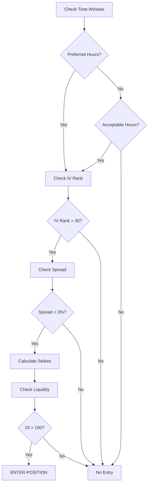
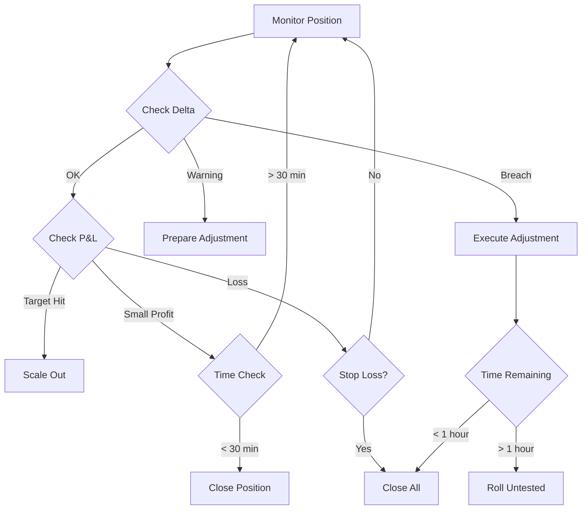
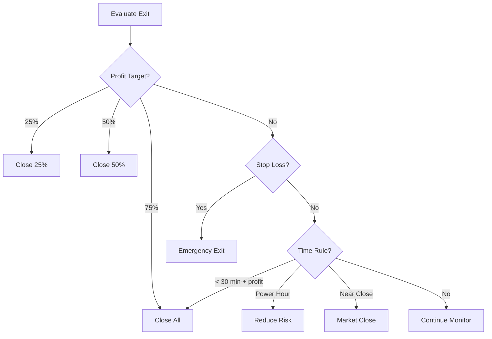

# Trading Rules & Automation Guide

## Overview
This document defines the specific trading rules, automation logic, and decision trees for the real-time strangle management system. These rules are based on our backtested probability analysis combined with real-world risk management principles.

## Entry Rules

### 1. Time-Based Entry Criteria
```python
ENTRY_WINDOWS = {
    "preferred": {
        "start": "14:00",  # 2:00 PM
        "end": "15:30",    # 3:30 PM
        "min_time_to_close": 30  # minutes
    },
    "acceptable": {
        "start": "12:00",  # 12:00 PM
        "end": "14:00",    # 2:00 PM
        "min_time_to_close": 120
    },
    "avoid": {
        "start": "09:30",  # 9:30 AM
        "end": "10:00",    # 10:00 AM
        "reason": "High volatility period"
    }
}
```

### 2. Market Condition Filters
```python
MARKET_CONDITIONS = {
    "iv_rank": {
        "minimum": 30,  # IV rank percentile
        "preferred": 50,
        "maximum": 90  # Avoid extreme volatility
    },
    "volume": {
        "spy_min_volume": 1000000,  # Last 5 min
        "option_min_oi": 100
    },
    "spread_requirements": {
        "max_spread_percent": 3.0,  # % of mid price
        "preferred_spread_percent": 2.0
    },
    "trend_filter": {
        "max_move_today": 2.0,  # % from open
        "preferred_range": 1.0
    }
}
```

### 3. Strike Selection Algorithm
```python
def select_strangle_strikes(spot_price, iv_rank, time_to_expiry):
    """
    Dynamic strike selection based on market conditions
    """
    # Base width from our probability analysis
    if time_to_expiry <= 2:  # 2 hours or less
        base_width = 0.5  # 0.5% OTM
    elif time_to_expiry <= 4:
        base_width = 0.4
    else:
        base_width = 0.3
    
    # Adjust for IV rank
    if iv_rank > 70:
        width_multiplier = 0.8  # Tighter strikes in high IV
    elif iv_rank < 30:
        width_multiplier = 1.2  # Wider strikes in low IV
    else:
        width_multiplier = 1.0
    
    final_width = base_width * width_multiplier
    
    call_strike = round(spot_price * (1 + final_width/100) * 2) / 2
    put_strike = round(spot_price * (1 - final_width/100) * 2) / 2
    
    return call_strike, put_strike
```

### 4. Position Sizing Rules
```python
POSITION_SIZING = {
    "max_risk_per_trade": 0.02,  # 2% of account
    "calculation": "max_loss = 3 * credit_received",
    "max_positions": 3,  # Concurrent positions
    "scale_in_rules": {
        "initial_size": 0.5,  # 50% of full size
        "add_criteria": "profit > 10% and delta < 0.05",
        "max_adds": 1
    }
}
```

## Exit Rules

### 1. Profit Target Management
```python
PROFIT_TARGETS = {
    "aggressive": {
        "target_1": 0.25,  # 25% of credit
        "action_1": "close_25_percent",
        "target_2": 0.50,  # 50% of credit
        "action_2": "close_50_percent",
        "target_3": 0.75,  # 75% of credit
        "action_3": "close_remaining"
    },
    "conservative": {
        "target_1": 0.50,  # 50% of credit
        "action_1": "close_all"
    },
    "time_based": {
        "rule": "if time_remaining < 30 and profit > 0.10",
        "action": "close_all"
    }
}
```

### 2. Stop Loss Rules
```python
STOP_LOSS_RULES = {
    "max_loss": {
        "threshold": -2.0,  # -200% of credit
        "action": "close_all_immediate"
    },
    "strike_breach": {
        "warning_distance": 0.005,  # 0.5% from strike
        "action_distance": 0.002,   # 0.2% from strike
        "action": "evaluate_adjustment"
    },
    "delta_breach": {
        "warning": 0.08,
        "action": 0.10,
        "emergency": 0.15
    }
}
```

### 3. Time-Based Exits
```python
TIME_EXITS = {
    "power_hour": {
        "time": "15:00",
        "condition": "position_delta > 0.05",
        "action": "reduce_risk"
    },
    "final_30": {
        "time": "15:30",
        "condition": "any_position_open",
        "action": "evaluate_all_positions"
    },
    "emergency_close": {
        "time": "15:55",
        "condition": "any_position_open",
        "action": "market_close_all"
    }
}
```

## Adjustment Rules

### 1. Delta Adjustment Logic
```python
def delta_adjustment_decision(position):
    """
    Determine if and how to adjust based on delta
    """
    current_delta = position.total_delta
    time_remaining = position.time_to_expiry
    current_pnl = position.pnl_percent
    
    if abs(current_delta) < 0.08:
        return "no_action", "Delta within acceptable range"
    
    elif 0.08 <= abs(current_delta) < 0.10:
        if current_pnl > 0:
            return "monitor", "Profitable position, monitor closely"
        else:
            return "prepare_adjustment", "Consider rolling untested side"
    
    elif 0.10 <= abs(current_delta) < 0.15:
        if time_remaining > 60:  # More than 1 hour
            return "roll_untested", "Roll the untested side out"
        else:
            return "close_position", "Too late to adjust, close position"
    
    else:  # Delta > 0.15
        return "emergency_close", "Delta too high, close immediately"
```

### 2. Rolling Strategy
```python
ROLLING_RULES = {
    "untested_side": {
        "trigger": "tested_side_within_1_percent",
        "new_strike": "2_percent_otm_from_current",
        "credit_requirement": "minimum_0.10",
        "max_rolls": 1
    },
    "tested_side": {
        "trigger": "strike_breached",
        "action": "close_entire_position",
        "reason": "Avoid undefined risk"
    },
    "both_sides": {
        "trigger": "whipsaw_market",
        "action": "close_and_wait",
        "wait_time": 30  # minutes
    }
}
```

### 3. Defensive Adjustments
```python
DEFENSIVE_ADJUSTMENTS = {
    "butterfly_hedge": {
        "trigger": "gamma > 0.15",
        "structure": "buy_butterfly_around_short_strike",
        "max_cost": "25% of original_credit"
    },
    "calendar_hedge": {
        "trigger": "iv_spike > 20%",
        "structure": "sell_next_expiry_same_strikes",
        "size": "50% of current_position"
    },
    "reduce_size": {
        "trigger": "portfolio_delta > 0.20",
        "action": "close_25_percent_all_positions"
    }
}
```

## Automation Decision Trees

### 1. Entry Decision Tree


### 2. Management Decision Tree


### 3. Exit Decision Tree


## Alert Configuration

### 1. Alert Priority Matrix
```python
ALERT_PRIORITIES = {
    "critical": {
        "conditions": [
            "position_loss > 150%",
            "delta > 0.15",
            "strike_breached",
            "system_failure"
        ],
        "notification": ["sound", "popup", "sms"],
        "auto_action": True
    },
    "high": {
        "conditions": [
            "profit_target_reached",
            "delta > 0.10",
            "approaching_strike",
            "unusual_volume"
        ],
        "notification": ["sound", "dashboard"],
        "auto_action": False
    },
    "medium": {
        "conditions": [
            "time_based_alert",
            "iv_change > 10%",
            "spread_widening"
        ],
        "notification": ["dashboard"],
        "auto_action": False
    }
}
```

### 2. Notification Templates
```python
ALERT_TEMPLATES = {
    "profit_target": "🎯 {symbol} {strikes} reached {percent}% profit target. Current P&L: ${pnl}",
    "delta_warning": "⚠️ {symbol} {strikes} delta at {delta}. Consider adjustment.",
    "strike_threat": "🚨 {symbol} approaching {strike} strike. Distance: {distance}%",
    "time_exit": "⏰ {symbol} {strikes} - {time} minutes to close. P&L: ${pnl}",
    "stop_loss": "🛑 {symbol} {strikes} at max loss. Closing position."
}
```

## Performance Tracking

### 1. Key Metrics to Track
```python
PERFORMANCE_METRICS = {
    "entry_metrics": [
        "entry_time",
        "iv_rank_at_entry",
        "spread_at_entry",
        "initial_delta",
        "credit_received"
    ],
    "management_metrics": [
        "max_favorable_excursion",
        "max_adverse_excursion",
        "time_at_profit_targets",
        "number_of_adjustments",
        "delta_path"
    ],
    "exit_metrics": [
        "exit_time",
        "exit_reason",
        "final_pnl",
        "time_in_position",
        "slippage"
    ]
}
```

### 2. Learning & Optimization
```python
OPTIMIZATION_RULES = {
    "weekly_review": {
        "metrics": ["win_rate", "avg_profit", "max_loss"],
        "adjustments": ["strike_width", "entry_times", "profit_targets"]
    },
    "monthly_calibration": {
        "analyze": ["iv_accuracy", "delta_patterns", "time_decay"],
        "update": ["models", "thresholds", "rules"]
    },
    "continuous_learning": {
        "feed_to_ml": True,
        "update_probabilities": True,
        "adjust_parameters": "gradual"
    }
}
```

## Conclusion

These trading rules and automation guidelines provide a comprehensive framework for systematic strangle trading. The rules are based on:

1. **Historical Analysis**: Our 65-day probability study
2. **Risk Management**: Professional trading principles
3. **Market Reality**: Bid-ask spreads, liquidity, and execution
4. **Continuous Improvement**: Learning from each trade

The system is designed to be:
- **Systematic**: Remove emotional decision-making
- **Flexible**: Adapt to market conditions
- **Safe**: Multiple layers of risk control
- **Profitable**: Based on positive expectancy rules

Remember: These rules should be paper-traded extensively before live implementation, and continuously refined based on real-world performance.